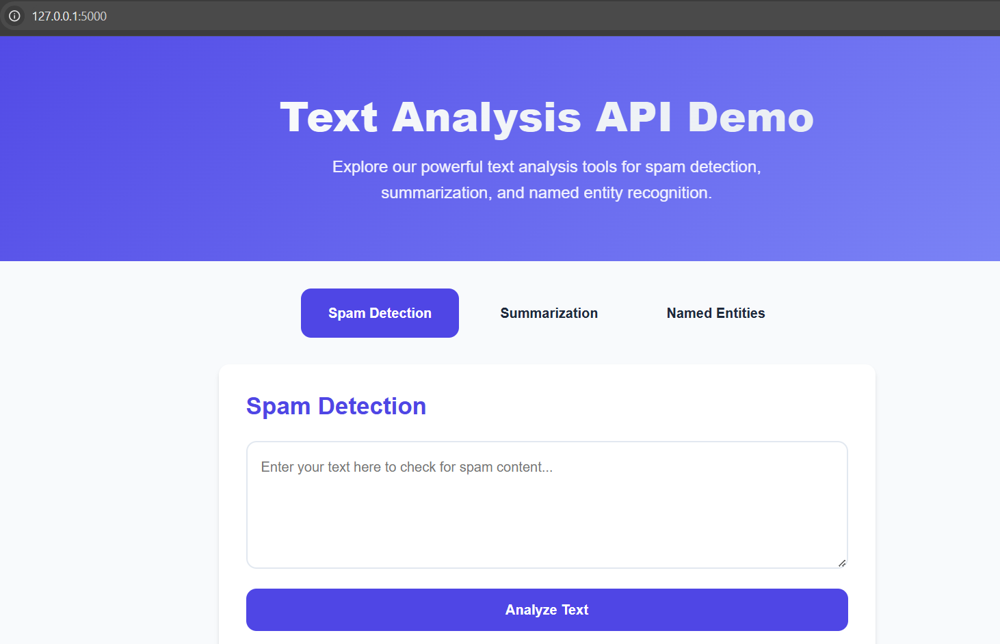

# Smart Email Management System 📧

A sophisticated email management solution powered by AI to intelligently handle, categorize, and analyze emails using advanced NLP techniques.

## Screenshots

Here are some screenshots of the project:



Another image:


## 🌟 Overview

Smart Email Management System is an intelligent email processing platform that leverages natural language processing (NLP) to automate email workflow management. The system provides powerful features including spam detection, email summarization, and entity recognition to help users efficiently manage their email communications.

## ✨ Key Features

- **🔍 Spam Detection**
  - Machine learning-powered spam identification
  - Real-time analysis of incoming emails
  - Custom spam scoring algorithms
  
- **📝 Email Summarization**
  - Automatic generation of email summaries
  - Key points extraction
  - Priority highlighting
  
- **🎯 Named Entity Recognition (NER)**
  - Automatic identification of people, organizations, and locations
  - Contact information extraction
  - Smart tagging system

## 🛠️ Technology Stack

### Backend
- Flask (Python Web Framework)
- Custom NLP Models:
  - Spam Detection: Machine Learning Classification
  - Summarization: Advanced Text Processing
  - NER: Named Entity Recognition System
- Model Management: Joblib

### Frontend
- HTML5/CSS3
- JavaScript (ES6+)
- Bootstrap 5.3

### Additional Tools
- Git for version control
- Virtual Environment for dependency management
- RESTful API architecture

## 📥 Installation

1. **Clone the Repository**
```bash
git clone https://github.com/yourusername/smart-email-management.git
cd smart-email-management
```

2. **Set Up Virtual Environment**
```bash
python3 -m venv venv
source venv/bin/activate  # For Windows: venv\Scripts\activate
```

3. **Install Dependencies**
```bash
pip install -r requirements.txt
```

4. **Run the Application**
```bash
python app.py
```
Visit `http://127.0.0.1:5000` in your browser.

## 🚀 API Endpoints

### Spam Detection
```json
POST /api/detect-spam
{
    "text": "Email content to analyze"
}
```

### Email Summarization
```json
POST /api/summarize
{
    "text": "Long email content to summarize"
}
```

### Named Entity Recognition
```json
POST /api/ner
{
    "text": "Email content for entity extraction"
}
```

## 📁 Project Structure
```
smart-email-management/
├── app.py                  # Main application file
├── requirements.txt        # Project dependencies
├── src/                   # Source code
│   ├── models/           # ML models
│   ├── processors/       # Email processing logic
│   └── utils/            # Utility functions
├── static/               # Static files (CSS, JS)
├── templates/            # HTML templates
└── tests/               # Test cases
```

## 🔄 Workflow

1. **Email Reception**
   - System receives email content through API
   - Initial preprocessing of email data

2. **Analysis Phase**
   - Spam detection analysis
   - Content summarization
   - Entity extraction and recognition

3. **Result Generation**
   - Compilation of analysis results
   - Generation of structured response
   - Client notification

## 🛡️ Security Features

- Input sanitization
- Rate limiting
- API key authentication
- Data encryption
- Secure email processing

## 🔜 Future Enhancements

- [ ] Integration with popular email providers
- [ ] Advanced ML model training capabilities
- [ ] Custom rule creation interface
- [ ] Batch processing support
- [ ] Enhanced analytics dashboard
- [ ] Multi-language support

## 📝 License

This project is licensed under the MIT License - see the [LICENSE](LICENSE) file for details.

## 👨‍💻 Created By

Made with ❤️ by [Dinesh Suthar](https://dineshsuthar.com)

## 🤝 Contributing

Contributions are welcome! Please feel free to submit a Pull Request.

1. Fork the project
2. Create your feature branch (`git checkout -b feature/AmazingFeature`)
3. Commit your changes (`git commit -m 'Add some AmazingFeature'`)
4. Push to the branch (`git push origin feature/AmazingFeature`)
5. Open a Pull Request

## 📞 Support

For support, email support@dineshsuthar.com or join our Slack channel.

---
© 2024 Smart Email Management System. All Rights Reserved.
